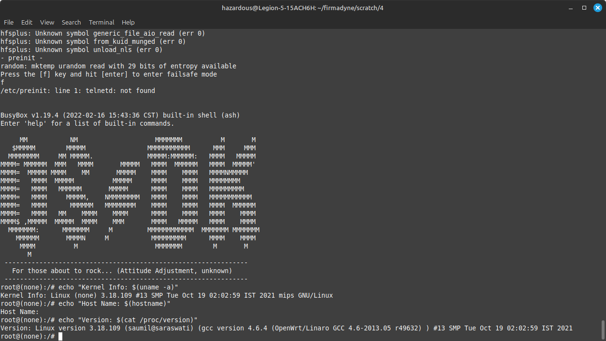

# TP-Link Archer AX23 Emulation Procedure to Reach Failsafe Mode

This document outlines the steps to emulate the Archer AX23 firmware and reach failsafe mode using the Firmware Analysis Toolkit and other necessary tools.

## Prerequisites

1. **Download and Install Firmware Analysis Toolkit**
    First, clone the [Firmware Analysis Toolkit](https://github.com/attify/firmware-analysis-toolkit) repository:

    ```bash
    git clone https://github.com/attify/firmware-analysis-toolkit
    cd firmware-analysis-toolkit

Follow the installation instructions provided in the repository to set up the toolkit.

2. **Obtain the Firmware**
   Download the firmware for the Archer AX23 (Hardware revision 1) router from the official website [Archer AX23](https://www.tp-link.com/en/support/download/archer-ax23/v1/#Firmware).
   In this case, the firmware file is named `Archer AX23(EU)_V1_220216`.

## Emulation Procedure

1. **Generate Firmadyne Environment**
    Utilize the FAT utility provided in the Firmware Analysis Toolkit to generate a Firmadyne environment using the firmware file:

    ```bash
    ./fat.py <path_to_firmware_file>

Replace <path_to_firmware_file> with the path to your Archer AX23 firmware file.

2.  **Mount the Filesystem Image for Repairs**
    If we attempt to emulate the firmware at this point, we will encounter an error due to filesystem corruption.
    ```bash
    hazardous@Legion-5-15ACH6H:~/firmadyne/scratch/3$ ./run.sh
    e2fsck 1.47.0 (5-Feb-2023)
    ext2fs_open2: Bad magic number in super-block
    e2fsck: Superblock invalid, trying backup blocks...
    e2fsck: Bad magic number in super-block while trying to open /home/hazardous/firmadyne//scratch//3//image.raw

    The superblock could not be read or does not describe a valid ext2/ext3/ext4
    filesystem.  If the device is valid and it really contains an ext2/ext3/ext4
    filesystem (and not swap or ufs or something else), then the superblock
    is corrupt, and you might try running e2fsck with an alternate superblock:
        e2fsck -b 8193 <device>
     or
        e2fsck -b 32768 <device>

    Found a dos partition table in /home/hazardous/firmadyne//scratch//3//image.raw
    ```

    To fix this, we need to inspect the filesystem image and repair it using the following steps:

    1- Use fdisk or parted to Inspect Partitions:
    ```bash
    sudo fdisk -l /home/<user>/firmadyne/scratch/<image_id>/image.raw
    ```
    The output will show the partitions in the filesystem image. In this case, the output is as follows:
    ```bash
    Disk /home/hazardous/firmadyne/scratch/3/image.raw: 64 MiB, 67108864 bytes, 131072 sectors
    Units: sectors of 1 * 512 = 512 bytes
    Sector size (logical/physical): 512 bytes / 512 bytes
    I/O size (minimum/optimal): 512 bytes / 512 bytes
    Disklabel type: dos
    Disk identifier: 0x08a00f29

    Device                                         Boot Start    End Sectors Size Id Type
    /home/hazardous/firmadyne/scratch/3/image.raw1       2048 131071  129024  63M 83 Linux
    ```
    2- Calculate the offset for the partition:
    Since the partition starts at sector 2048 and each sector is 512 bytes, calculate the offset as follows:
    ```bash
    OFFSET=$((2048 * 512))  # This results in 1048576 bytes
    ```

    3- Mount the filesystem image and repair it using the following command:

      ```bash
      sudo losetup -o ${OFFSET} /dev/loop1 /home/<user>/firmadyne/scratch/<image_id>/image.raw
      sudo e2fsck -y /dev/loop1
      sudo losetup -d /dev/loop1

3. **Update Kernel Parameter**
    Does it work now? No, it doesn't. We will encounter another error:
    ```bash
    [0.000000] Initrd not found or empty - disabling initrd
    ```
    The kernel version used in the Firmadyne environment is outdated and needs to be updated.
    Open the run.sh script located in the Firmadyne directory and locate the kernel parameter.
    Replace the existing kernel parameter with a newer kernel version that you can obtain from EMUX [Template Kernels](https://github.com/therealsaumil/emux/blob/master/files/emux/template/kernel/):
    In this case, the kernel file is named `vmlinux-3.18.109-malta-le`.

#### Example line to replace
  ${QEMU} -m 256 -M ${QEMU_MACHINE} -kernel ${KERNEL} \

##### Replace with
  ${QEMU} -m 256 -M ${QEMU_MACHINE} -kernel <path_to_new_kernel_file>

4. **Start the Emulation**
    Start the emulation using the following command:

    ```bash
    ./run.sh <image_id>

Watch out for the boot message to enter the failsafe mode.
Press `Ctrl + A` followed by `X` to exit the emulation.

Screenshot of the failsafe mode:


## Notes
- This procedure is based on the Archer AX23 firmware and may require modifications for other firmware versions.
- This procedure is intended for educational purposes only.
- The procedure is likely to work with other TP-Link routers as well. (Especially those with similar hardware and firmware structure like Hardware Revision 1.20 of Archer AX23)

References:
- [Firmware Analysis Toolkit](https://github.com/attify/firmware-analysis-toolkit)
- [Firmadyne](https://github.com/firmadyne/firmadyne)
- [EMUX (Formerly ARMX)](https://github.com/therealsaumil/emux)
- [TP-Link Archer AX23 Firmware](https://www.tp-link.com/us/support/download/archer-ax23/#Firmware)
```
